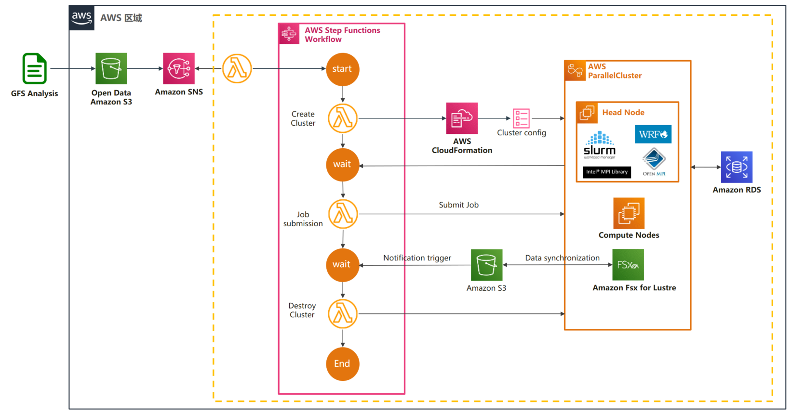

# Event Driven WRF on AWS


A fully automated cloud-native event driven weather forecasting.

For HPC6a instance only available in us-east-2, you should deploy the solution in this region.

## Prerequisites
1. Create an EC2 Key pair with name us-east-2.
2. Create S3 bucket to host input files of each domain that necessary for WRF running and the output files ,the structure should like belowing:
```
---my-bucket-name
    |---inputs
    |       |---domain_1
    |       |       |---namelist.wps
    |       |       |---namelist.input
    |       |---domain_2
    |               |---namelist.wps
    |               |---namelist.input
    |---outputs
```  
## Installation

Install the AWS CDK application and the python library.

```
npm install -g aws-cdk
cd src/
python3 -m venv .venv
. .venv/bin/activate
pip install -r requirements.txt
```
## Deploying

Create a lambda layer that contains `requests` and `pyyaml`.
```
cd layer
pip install -r requirements.txt -t python/
zip -r ../layer.zip python
cd ..
```

Then deploy the CDK stack. Note: you must specify a bucket where you want the
forecast output uploaded to, in the following example I am using
`my-bucket-name`.

```
cdk bootstrap
cdk deploy --parameters BucketName=my-bucket-name
```
default forecast domains and default forecast days are both 2, if you need change the setting, please deploy the CDK stack with optional parameters. the number of domains need to be consistent with contents of S3 bucket' inputs folder.
```
cdk deploy --parameters BucketName=my-bucket-name --parameters DomainNum=1 --parameters ForecastDays=1 
```
## Cleanup

To completely tear down all infrastructure when it is not needed.

```
cdk destroy --all
```
